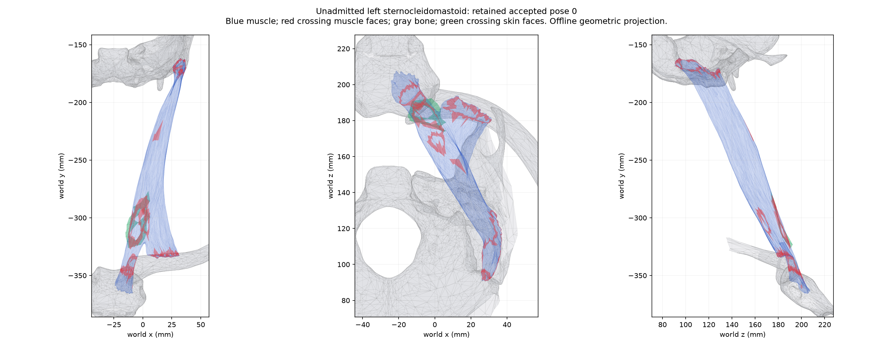

# Passive neck/back integration preparation — unadmitted

The existing NHTISS4 ABI5 owner now imports bilateral sternocleidomastoid and the three named trapezius portions, with explicit source identities and inferred registered support weights. They add no muscle force route, constitutive law, or physical mass. Default generation retains the original 150 routed rows; these eight additions require an explicit subset until geometry is qualified.

An actual 158-row append to the corrected 22-surface native candidate preserves every parent row and binding byte. Its anatomy receipt retains the existing cardiac assets and mass accounting. This is preparation evidence, not native execution or anatomical acceptance.

- Source subset payload: 08c534229c322391ce5c7fb972810ace13bc07cf9d95ff18825561ac2f792ada.
- Combined payload: 5e026b3acdaf74d0133346be28928bc2d8c48f3427e3cf904aa5ea33df96e4c7.
- 119 focused regression tests passed on the Mac mini. The validation record states the precise selection and the earlier sparse-checkout failure.
- Seven source surfaces retain self-intersections. The left SCM is self-clear, but has 1,169/1,143 triangle-pair crossings with existing anatomy at retained steps 0/8,000, including 126/120 skin pairs. Counts are not penetration depths or evidence of intended interfaces.
- All eight rows were forward-mapped through 157 accepted body poses at each endpoint, then checked against 860 existing anatomical targets and each other. This is an offline diagnostic, not a native candidate run, complete-breath qualification, or final five-minute evidence.
- The historical offline forward helper skipped tiny positive weights. The retained derived helper includes every positive weight, matching the native rule; source and derived code are both identifiable.
- The native reader supports 192 rows. Physical mass/route receipt consumers remain scoped to their original owners.
- The last qualified short native anatomy increment remains [the corrected 22-surface run](../native-anatomy-twenty-two-surfaces-1284/README.md).

The image is a diagnostic projection of the left SCM using actual accepted body poses. Bone overlaps near attachment ends require source-level localization; skin crossings require correction. No blanket interface waiver has been applied.

All large payloads and accepted native packs remain on the Mac mini at the hash-bound paths in the reports. The retained-inputs file maps these compact copies to their originals.

Large JSON reports use lossless gzip; their original logical hashes and stored hashes are both recorded. Retained scripts preserve original whitespace.
